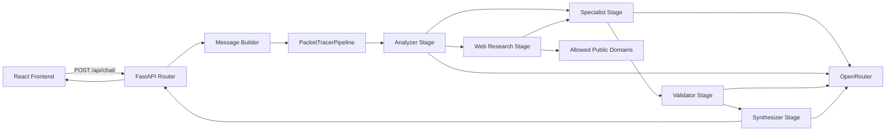
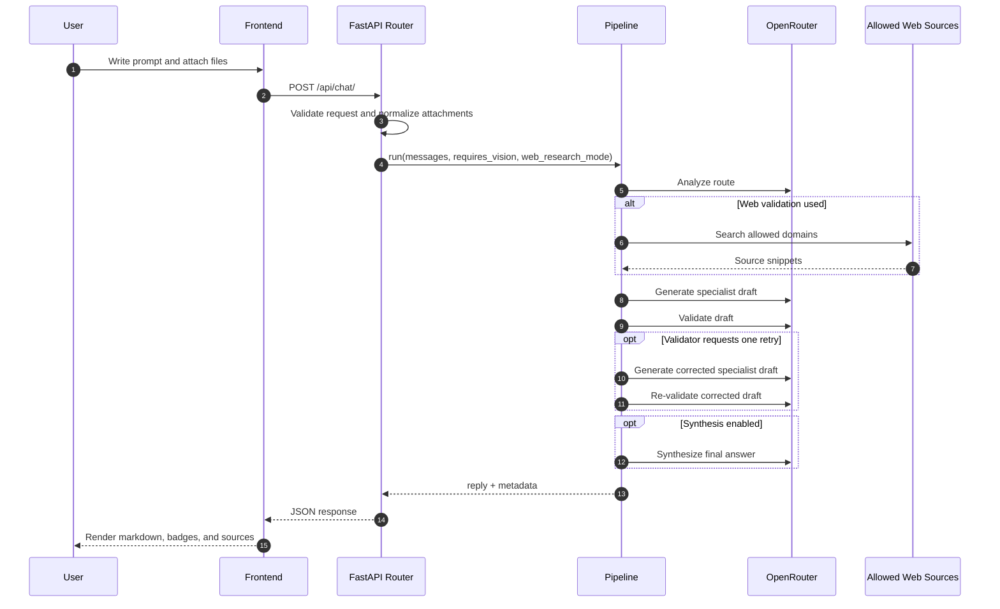

# Packet Tracer Backend

FastAPI backend for the Packet Tracer AI workspace. This service receives chat requests from the React frontend, normalizes text and attachments, runs a staged Packet Tracer assistance pipeline on top of OpenRouter, and returns both the final answer and rich execution metadata.

## Responsibilities

- Expose the HTTP API used by the chat UI.
- Accept multi-turn chat history with optional attachments.
- Convert supported files into model-ready text or vision inputs.
- Orchestrate a multi-stage specialist pipeline for networking and Cisco Packet Tracer questions.
- Enforce CORS for the local frontend and any configured deployed origins.
- Return response metadata so the UI can explain how an answer was produced.

## Technology Stack

- Python 3.11+
- FastAPI
- Pydantic
- httpx
- python-docx
- OpenRouter as the model gateway

## Project Structure

```text
packet_tracer_backend/
|-- app/
|   |-- __init__.py
|   |-- config.py                 # Environment loading and runtime settings
|   |-- models/
|   |   |-- __init__.py
|   |   `-- schemas.py            # Request, response, metadata, and attachment models
|   |-- routers/
|   |   |-- __init__.py
|   |   `-- chat.py               # Chat endpoint, attachment parsing, and message building
|   `-- services/
|       |-- __init__.py
|       |-- openrouter.py         # OpenRouter client, fallback handling, transport errors
|       |-- pipeline.py           # Analyzer, specialist, validator, synthesizer workflow
|       `-- web_research.py       # External source lookup constrained by allowed domains
|-- tests/
|   |-- test_chat.py              # API and attachment validation tests
|   |-- test_main.py              # Root and health endpoint tests
|   `-- test_message_building.py  # Message trimming and multimodal payload tests
|-- docker-compose.yml            # Local container run for the backend only
|-- Dockerfile                    # Python runtime image for deployment
|-- main.py                       # FastAPI app creation and middleware wiring
|-- pyproject.toml                # Ruff configuration
|-- requirements.txt              # Python dependencies
`-- README.md
```

Generated or local-only directories such as venv/, __pycache__/, .pytest_cache/, and .ruff_cache/ are part of development workflows but are not part of the source architecture.

## Runtime Flow

1. The frontend sends a chat payload to POST /api/chat/.
2. The router validates the request using Pydantic schemas.
3. User attachments are decoded and transformed into either plain text context or vision inputs.
4. The pipeline classifies the request route.
5. Optional web research runs when enabled and justified by route and mode.
6. A specialist model drafts the technical answer.
7. A validator reviews the draft and may trigger one corrective retry.
8. An optional synthesizer improves presentation without changing validated technical content.
9. The API returns the final reply and execution metadata.

## Architecture Diagram



## Sequence Diagram



## Pipeline Stages

The orchestration in app/services/pipeline.py is intentionally structured instead of relying on a single free-form LLM call.

1. Analyzer: classifies the request into a route such as troubleshooting, guided lab, explanation, or evidence analysis.
2. Web researcher: gathers public references from an allowlist when web validation is enabled.
3. Specialist: produces the primary networking answer.
4. Validator: checks the answer for consistency and may request one retry.
5. Synthesizer: improves clarity and formatting after the answer is technically accepted.

## Supported Input Types

The backend accepts a chat message list where each user message can include up to four attachments.

Supported attachment categories:

- Images: any MIME type starting with image/.
- DOCX documents: parsed into text.
- Plain text and technical text files: txt, log, cfg, md.

Current limits enforced by the API:

- Maximum 12 history messages kept per request.
- Maximum 4 attachments per user message.
- Maximum 4 MB per attachment.
- Maximum 12,000 extracted characters per text-based attachment.

## Request Contract

The backend request model is defined in app/models/schemas.py.

```json
{
  "messages": [
    {
      "role": "user",
      "content": "Explain why inter-VLAN routing is failing.",
      "attachments": [
        {
          "name": "topology.png",
          "mime_type": "image/png",
          "data_url": "data:image/png;base64,..."
        }
      ]
    }
  ],
  "options": {
    "web_research_mode": "auto"
  }
}
```

The response always contains reply and may include metadata with route, validation, source usage, and stage execution details.

## API Surface

### GET /

Returns service metadata, version, docs path, configured chat endpoint, and allowed origins.

Example response:

```json
{
  "name": "Cisco Packet Tracer Assistant",
  "version": "1.0.0",
  "status": "ok",
  "docs": "/docs",
  "chat_endpoint": "/api/chat/",
  "allowed_origins": [
    "http://127.0.0.1:5173",
    "http://localhost:5173",
    "http://127.0.0.1:4173",
    "http://localhost:4173"
  ]
}
```

### GET /health

Lightweight health check used for smoke tests and container validation.

Example response:

```json
{
  "status": "ok"
}
```

### POST /api/chat/

Primary endpoint used by the frontend.

Accepted web research modes:

- auto: let the pipeline decide.
- force: force web validation when feasible.
- off: disable web validation for the request.

Example request:

```json
{
  "messages": [
    {
      "role": "user",
      "content": "There is no connectivity between VLAN 10 and VLAN 20.",
      "attachments": []
    }
  ],
  "options": {
    "web_research_mode": "force"
  }
}
```

Example response:

```json
{
  "reply": "## Diagnosis\n...",
  "metadata": {
    "route": "troubleshooting",
    "route_label": "Troubleshooting",
    "route_reason": "The request describes a connectivity failure.",
    "validation_status": "validated",
    "used_vision": false,
    "used_web_validation": true,
    "web_validation_status": "used",
    "correction_attempted": false,
    "specialist_attempts": 1,
    "synthesis_status": "used",
    "stages": [
      "analyzer",
      "web_researcher",
      "specialist",
      "validator",
      "synthesizer"
    ]
  }
}
```

### Error Behavior

The API returns explicit HTTP errors for common failure classes:

- 400: invalid attachment data, unsupported file type, or local validation error.
- 500: missing critical server configuration or unexpected internal failure.
- 502: OpenRouter transport failure or upstream model error.

## Configuration

Copy .env.example to .env and fill in the required values.

### Required

- OPENROUTER_API_KEY: API key used to call OpenRouter.

### Core Model Settings

- OPENROUTER_BASE_URL: OpenRouter base URL.
- MODEL_NAME: default text model.
- FALLBACK_MODEL_NAMES: comma-separated fallback text models.
- VISION_MODEL_NAME: default image-capable model.
- VISION_FALLBACK_MODEL_NAMES: comma-separated fallback vision models.

### Frontend Integration

- FRONTEND_ORIGINS: comma-separated list of allowed frontend origins for CORS.

### Web Validation

- WEB_RESEARCH_ENABLED: globally enables or disables web validation.
- WEB_RESEARCH_TIMEOUT_SECONDS: HTTP timeout for web lookups.
- WEB_RESEARCH_MAX_RESULTS: maximum number of web results used.
- WEB_RESEARCH_ALLOWED_DOMAINS: comma-separated domain allowlist.

The default CORS configuration already includes the common local Vite and preview URLs on ports 5173 and 4173.

## Example .env

```dotenv
OPENROUTER_API_KEY=your_openrouter_api_key
OPENROUTER_BASE_URL=https://openrouter.ai/api/v1
MODEL_NAME=stepfun/step-3.5-flash:free
FALLBACK_MODEL_NAMES=stepfun/step-3.5-flash:free,nvidia/nemotron-3-super-120b-a12b:free,qwen/qwen3-next-80b-a3b-instruct:free,openai/gpt-oss-20b:free,openrouter/free
VISION_MODEL_NAME=nvidia/nemotron-nano-12b-v2-vl:free
VISION_FALLBACK_MODEL_NAMES=nvidia/nemotron-nano-12b-v2-vl:free,openrouter/free
WEB_RESEARCH_ENABLED=true
WEB_RESEARCH_TIMEOUT_SECONDS=10
WEB_RESEARCH_MAX_RESULTS=2
WEB_RESEARCH_ALLOWED_DOMAINS=cisco.com,learningnetwork.cisco.com,netacad.com,ietf.org,rfc-editor.org
FRONTEND_ORIGINS=http://127.0.0.1:5173,http://localhost:5173,http://127.0.0.1:4173,http://localhost:4173
```

## Integration With The Frontend

The expected local pairing is:

```text
Frontend dev server:  http://127.0.0.1:5173/
Frontend preview:     http://127.0.0.1:4173/
Backend API root:     http://127.0.0.1:8000/
Chat endpoint:        http://127.0.0.1:8000/api/chat/
```

If you change frontend ports, preview ports, or deploy to a different origin, update FRONTEND_ORIGINS accordingly.

## Local Development

Install dependencies:

```bash
pip install -r requirements.txt
```

Run the development server:

```bash
python -m uvicorn main:app --reload
```

Default local URLs:

```text
API root:    http://127.0.0.1:8000/
Health:      http://127.0.0.1:8000/health
Swagger UI:  http://127.0.0.1:8000/docs
Chat API:    http://127.0.0.1:8000/api/chat/
```

## Validation

Run tests:

```bash
python -m pytest
```

Run lint checks:

```bash
python -m ruff check .
```

Current tests cover:

- Root and health endpoints.
- Chat endpoint behavior with mocked pipeline responses.
- Attachment rejection and size/type validation.
- Vision activation for image inputs.
- Message trimming and multimodal payload building.
- Pipeline retry, validation, and synthesis behavior.

## Docker

Build the image:

```bash
docker build -t packet-tracer-backend .
```

Run with Docker Compose:

```bash
docker compose up --build
```

The compose file exposes the service on port 8000 and forwards the OpenRouter-related environment variables into the container.

Container runtime summary:

- Base image: python:3.12-slim
- Exposed port: 8000
- Entrypoint: uvicorn main:app --host 0.0.0.0 --port 8000

## Operational Notes

- The assistant system prompt is currently defined in app/routers/chat.py.
- The application answers end users in Spanish even though the project documentation is maintained in English.
- CORS failures usually indicate a mismatch between the frontend origin and FRONTEND_ORIGINS.
- If OpenRouter is unavailable or misconfigured, the API returns explicit 5xx or 502 errors instead of silent failures.

## CI

The backend CI workflow runs the same core validation expected locally:

- Ruff linting
- Pytest suite
- Container build
- Smoke checks against / and /health
