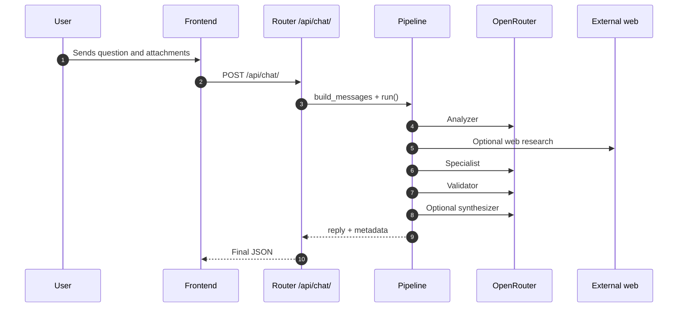

# Packet Tracer Backend

FastAPI backend for the Cisco Packet Tracer assistance console. It exposes the chat API, processes attachments, applies configurable CORS, and orchestrates a lightweight multi-agent pipeline on top of OpenRouter.

## What It Does

- Exposes the project's HTTP API at /api/chat/.
- Accepts messages with history, attachments, and web validation mode.
- Converts images into vision inputs and extracts text from DOCX and technical text files.
- Runs a multi-agent pipeline with analyzer, web researcher, specialist, validator, and synthesizer stages.
- Returns reply and metadata so the frontend can display route, stages, and web validation usage.

## Requirements

- Python 3.11 or newer
- Environment variables based on .env.example
- A valid OpenRouter key in OPENROUTER_API_KEY

## Configuration

Main variables:

- OPENROUTER_API_KEY: credential used to call OpenRouter.
- MODEL_NAME and FALLBACK_MODEL_NAMES: text models.
- VISION_MODEL_NAME and VISION_FALLBACK_MODEL_NAMES: vision models.
- FRONTEND_ORIGINS: CSV list of allowed CORS origins.
- WEB_RESEARCH_ENABLED and WEB_RESEARCH_ALLOWED_DOMAINS: web validation controls.

By default, the backend allows the common Vite origins used for development and preview. If you change ports or domain, update FRONTEND_ORIGINS.

## Local Development

Install:

```bash
pip install -r requirements.txt
```

Run locally:

```bash
python -m uvicorn main:app --reload
```

Useful endpoints:

- GET /: service metadata.
- GET /health: lightweight healthcheck.
- POST /api/chat/: main chat endpoint.

## Current Architecture

The implementation uses a controlled multi-agent pipeline in app/services/pipeline.py:

1. Analyzer: classifies the request into troubleshooting, guided lab, command validation, technical explanation, evidence analysis, or general assistance.
2. Web researcher: queries allowed external sources when the route and mode justify it.
3. Specialist: generates the main technical draft for the selected route.
4. Validator: reviews the answer and can request a single retry from the specialist.
5. Synthesizer: improves clarity and structure without changing validated technical content.

## Summary Flow



## Main Structure

- main.py: FastAPI application, CORS, and base endpoints.
- app/routers/chat.py: chat endpoint, attachment transformation, and HTTP error handling.
- app/services/pipeline.py: multi-agent orchestration.
- app/services/openrouter.py: HTTP client with model fallback.
- app/services/web_research.py: web validation using allowed domains.
- app/models/schemas.py: Pydantic input and output contracts.
- tests/test_main.py, tests/test_chat.py, and tests/test_pipeline.py: base backend coverage.

## API Examples

### GET /health

```json
{
  "status": "ok"
}
```

### POST /api/chat/

```json
{
  "messages": [
    {
      "role": "user",
      "content": "There is no connectivity between VLAN 10 and 20",
      "attachments": []
    }
  ],
  "options": {
    "web_research_mode": "force"
  }
}
```

Expected response:

```json
{
  "reply": "## Diagnosis\n...",
  "metadata": {
    "route": "troubleshooting",
    "validation_status": "validated",
    "used_web_validation": true,
    "stages": ["analizador", "investigador_web", "especialista", "validador", "sintetizador"]
  }
}
```

## Validation

Backend tests:

```bash
python -m pytest
```

Backend lint:

```bash
python -m ruff check .
```

Currently validated coverage:

- / and /health endpoints.
- POST /api/chat/ with mocked pipeline responses.
- Rejection of invalid attachments.
- Vision activation for image attachments.
- Multimodal message building, DOCX truncation, and trimmed history.
- Pipeline orchestration with retry, validation, and synthesis.

## Docker

Build:

```bash
docker build -t packet-tracer-backend .
```

Run:

```bash
docker compose up --build
```

## CI

The GitHub Actions workflow is defined in .github/workflows/backend-ci.yml and runs:

- python -m ruff check .
- python -m pytest
- container build plus smoke tests against /health and /
